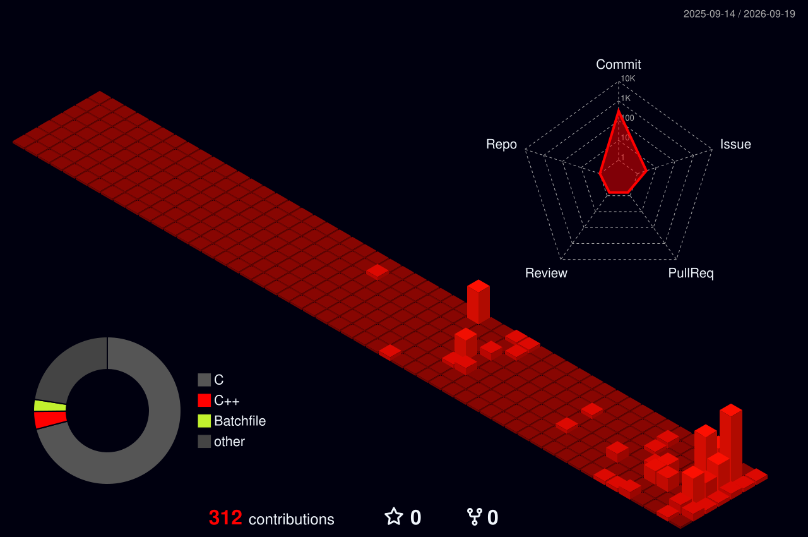

  
  

  <h1>Olá! 👋 Eu sou o Alexsander (Alex AR)</h1>
  
  

  
Estudante de Ciência da Computação, Desenvolvedor e Pesquisador de Segurança da Informação 🇧🇷

---

### 🚀 Sobre Mim & Áreas de Atuação

* 🏢 **Fundador & Criador:** [ALRI Group](https://github.com/alrigroup/)
* ⚙️ **Desenvolvimento Back-end:** Sistemas escaláveis, APIs e arquiteturas robustas.
* 🛡️ **Segurança Cibernética:** Consultor de segurança & Bug Bounty hunter (+50 vulnerabilidades reportadas).
* 🌐 **Desenvolvimento Front-end & Cliente:** Aplicações web e softwares nativos.
* ⚙️ **Desenvolvimento de Sistemas:** Soluções personalizadas da arquitetura de software até integração em nível de hardware.
* 🎮 **Desenvolvimento de Jogos:** Lógica de gameplay, mecânicas e nível de engine.
* 🛠️ **Modding & Engenharia Reversa:** Modificações de baixo nível, soluções root Samsung/Android e análise de segurança.
* 🗣️ **Idiomas:** Português (Nativo), Inglês (C2 / Fluente).

---

### 🛠️ Tecnologias & Stack

<strong>Linguagens:</strong>

<table>
  <tr>
    <td></td>
    <td></td>
    <td></td>
    <td></td>
    <td></td>
    <td></td>
    <td></td>
    <td></td>
  </tr>
</table>

<strong>Web & Ecossistema:</strong>

<table>
  <tr>
    <td></td>
    <td></td>
    <td></td>
    <td></td>
    <td></td>
    <td></td>
    <td></td>
  </tr>
</table>

<strong>Ambientes & Ferramentas:</strong>

<table>
  <tr>
    <td></td>
    <td></td>
    <td></td>
    <td></td>
  </tr>
</table>

---

### 📊 Atividade no GitHub & Métricas

  

 

  

 

  <!-- Contador de Visualizações -->
  
   
  Contando visualizações a partir de hoje

---

### 🧊 Gráfico de Contribuições em 3D

  

---

### 🐍 Animação do Gráfico de Contribuições

  <picture>
    <source media="(prefers-color-scheme: dark)" srcset="https://raw.githubusercontent.com/alexsanderalri/alexsanderalri/output/github-snake-dark.svg" />
    <source media="(prefers-color-scheme: light)" srcset="https://raw.githubusercontent.com/alexsanderalri/alexsanderalri/output/github-snake.svg" />
    
  </picture>

---

### 🌐 Contato

